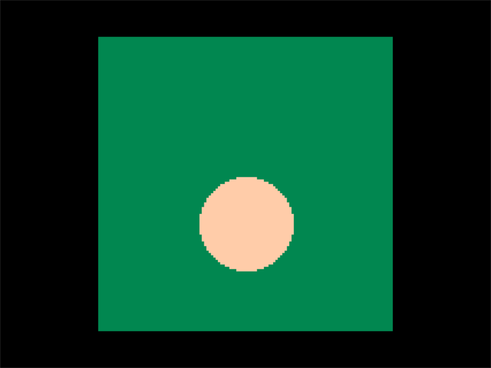
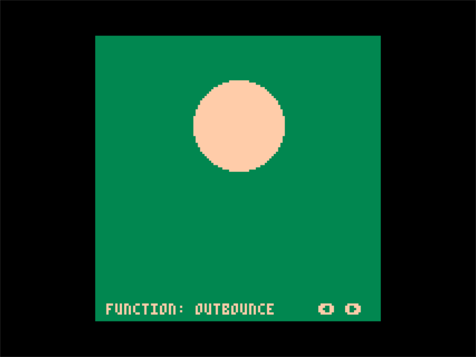
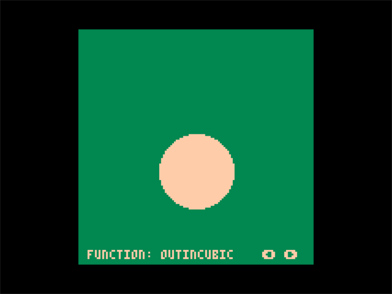

[](https://github.com/JoebRogers/PICO-Tween/graphs/commit-activity) 
[](https://en.wikipedia.org/wiki/MIT_License) 
[](https://joebrogers.com) 
[](https://twitter.com/JoebMakesGames)
[](https://www.lexaloffle.com/pico-8.php)


PICO-Tween is a port of the easing functions developed by Robert Penner. This port was based on the Lua port by EmmanuelOga 
and optimised to suit the PICO-8 by refactoring to remove unnecessary tokens and making it compatible with the way the PICO-8
handles math functions.

Some important things to note:

- Despite being optimised, this library as a whole is still huge. It would be in your best interests to grab only
the functions you plan on using, along with their support functions/variables.

- The overall token count for the library is ~~1556~~ 2083, with an average of around 40-60 tokens per easing function.

- ~~This library has had the elastic easing functions removed as they relied on asin and acos, which are not
available within the PICO-8. My math skills do not extend far enough for me to implement a solution for them 
that doesn't rely on those functions.~~

- Thanks to the Nvidea CG Toolkit references, the library now comes with implementations of asin and acos. This means
that elastic easings have been reincluded and should be working as intended.

- An important thing to note is that in order for the sine easings to work correctly, I've used the radian based
conversion for the base sin and cos functions without the y inversion:
```lua
cos1 = cos function cos(angle) return cos1(angle/(3.1415*2)) end
sin1 = sin function sin(angle) return sin1(-angle/(3.1415*2)) end
```
If you rely on sin and cos within your game and don't want to use radian based angles, then you'll need to adapt your
input to the easing function accordingly to perform these calculations manually.

## PICO-TweenMachine

Alongside this library, I've also released an extension library to act as a support for this. It's a lightweight wrapper
to help drive and manage all tween objects and related code in order to reduce boilerplate and mess, as well as simplify
the process of creating and using tweens.

You can view the repository here: [PICO-TweenMachine](https://github.com/JoebRogers/PICO-TweenMachine).

## Setup

Like any PICO-8 library, integrating this library into your cart is as simple as copy/pasting the source
into the top of your code (I recommend the top in order to avoid problems with object ordering).

If you only need a small number of easing functions and are planning on using them individually, be sure to 
check for their dependencies. For example, there is a definition of Pi at the top of the library that might need to be
copied over, along with radian based sin and cos function redefinitions used within the sine easing functions.

## Basic Usage

Any of these functions should be simple to just plug in and play, provided you have a basic knowledge of how to use
easing functions.

Here is a basic example of using the linear function to move across the screen:

```lua
function linear(t, b, c, d)
  return c * t / d + b
end

local distance = 50
local duration = 1

function downFunc(v)
  return linear(v, 0, distance, duration)
end

function upFunc(v)
  return linear(v, distance, -distance, duration)
end

local easeProp = 0
local timeElapsed = 0
local currentFunc = downFunc
local lastTime = time()
local dt = 0

function _update()
  t = time()
  dt = t - lastTime
  lastTime = t
  timeElapsed += dt

  if timeElapsed > duration then
    timeElapsed = 0
    if currentFunc == downFunc then currentFunc = upFunc else currentFunc = downFunc end
  end

  easeProp = currentFunc(timeElapsed)
end

function _draw()
  rectfill(0, 0, 128, 128, 3)
  circfill(64, 40 + easeProp, 20, 15)
end
```

You should get the following results:



## Examples

You can find a test cart that allows you to cycle through all of the easing functions in the [cart](cart/pico-tween-demo.p8) folder 
if you want to load it up into the console and play around with it!

Here are some example gifs:





## Credits

This library port wouldn't have been possible without the original easings functions by [Robert Penner.](http://robertpenner.com/easing/)

It also wouldn't have been anywhere near as easy without the Lua port for the functions by [EmmanuelOga](https://github.com/EmmanuelOga/easing)
